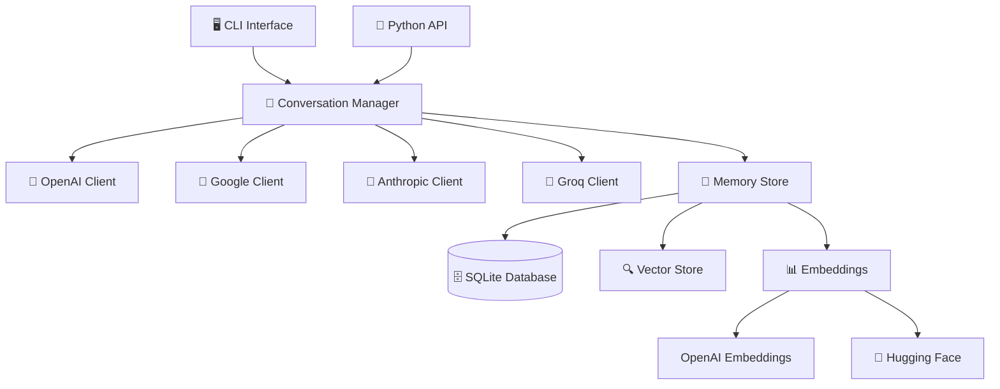

<div align="center">

# 🧠 Universal Memory Layer

**Seamless conversation continuity across multiple AI models**

[](https://python.org)
[](LICENSE)
[](tests/)
[](docs/)

[](https://openai.com)
[](https://ai.google.dev)
[](https://anthropic.com)
[](https://groq.com)

*Switch between ChatGPT, Claude, Gemini, and Groq models while maintaining perfect conversation context*

</div>

---

## ✨ Features

🔄 **Multi-LLM Support** - Seamlessly switch between OpenAI, Google, Anthropic, and Groq models  
💾 **Persistent Memory** - Store conversation history with metadata across different providers  
🔍 **Semantic Search** - Find relevant messages using vector embeddings for intelligent context retrieval  
🎯 **Unified Interface** - Consistent API for interacting with different LLM providers  
💬 **Interactive CLI** - Easy-to-use command-line interface for conversations  
⚙️ **Configurable Embeddings** - Support for OpenAI and Hugging Face embedding providers  
🧩 **Context Strategies** - Multiple strategies for retrieving conversation context (recent, relevant, hybrid)  
🛡️ **Error Handling** - Graceful handling of API failures and rate limits

## 🚀 Quick Start

### Installation

```bash
# Clone the repository
git clone https://github.com/CodeGovindz/MindLayer.git
cd MindLayer

# Install dependencies
pip install -r requirements.txt

# Install the package
pip install -e .
```

### API Keys Setup

Set up your API keys (at least one required):

```bash
# OpenAI (for ChatGPT, GPT-4)
export OPENAI_API_KEY="sk-your-openai-key"

# Google (for Gemini)
export GOOGLE_API_KEY="AIza-your-google-key"

# Anthropic (for Claude)
export ANTHROPIC_API_KEY="sk-ant-your-anthropic-key"

# Groq (for Llama, Mixtral)
export GROQ_API_KEY="gsk-your-groq-key"
```

### Launch

```bash
# Interactive CLI
python -m universal_memory_layer.cli.main

# Or use the console script
uml
```

## 🎯 Supported Models

| Provider | Models | Status |
|----------|--------|--------|
| **OpenAI** | GPT-4, GPT-3.5-turbo, GPT-5-nano | ✅ Supported |
| **Google** | Gemini Pro, Gemini-2.0-flash | ✅ Supported |
| **Anthropic** | Claude-3 Sonnet | ✅ Supported |
| **Groq** | Llama-3.1-8B, Mixtral-8x7B | ✅ Supported |

## 💡 Usage Examples

### Interactive CLI

```bash
# Start the CLI
python -m universal_memory_layer.cli.main

# Available commands:
/help              # Show all commands
/models            # List available models  
/switch            # Switch between models
/recent 5          # Show last 5 messages
/search "topic"    # Search conversation history
/stats             # Show memory statistics
/quit              # Exit
```

### Programmatic Usage

```python
from universal_memory_layer.conversation_manager import ConversationManager

# Initialize
manager = ConversationManager()
manager.initialize()

# Chat with GPT-4
manager.switch_model("gpt-4")
response = manager.chat("Hello! How are you?")

# Switch to Gemini while maintaining context
manager.switch_model("gemini-2.0-flash")
response = manager.chat("What did we just talk about?")

# Use different context strategies
response = manager.chat(
    "Tell me more about that topic",
    context_strategy="relevant",  # or "recent", "hybrid"
    context_count=5
)
```

### Model Switching Demo

```python
# Available models
models = manager.get_available_models()
# ['chatgpt', 'gpt-4', 'gemini', 'gemini-2.0-flash', 'claude', 'llama-3.1-8b', 'mixtral-8x7b']

# Seamless switching with memory retention
manager.switch_model("llama-3.1-8b")  # Groq
response1 = manager.chat("I love machine learning")

manager.switch_model("gemini-2.0-flash")  # Google  
response2 = manager.chat("What do I love?")  # Remembers context!
```

## ⚙️ Configuration

### Environment Variables

| Variable | Description | Default | Example |
|----------|-------------|---------|---------|
| `OPENAI_API_KEY` | OpenAI API key | - | `sk-proj-...` |
| `GOOGLE_API_KEY` | Google AI API key | - | `AIza...` |
| `ANTHROPIC_API_KEY` | Anthropic API key | - | `sk-ant-...` |
| `GROQ_API_KEY` | Groq API key | - | `gsk_...` |
| `UML_EMBEDDING_PROVIDER` | Embedding provider | `openai` | `huggingface` |
| `UML_DATABASE_PATH` | Database file path | `memory.db` | `./data/memory.db` |
| `UML_LOG_LEVEL` | Logging level | `WARNING` | `INFO` |

### Configuration File

Create a `.env` file for easy setup:

```bash
# API Keys
OPENAI_API_KEY=sk-your-openai-key
GOOGLE_API_KEY=AIza-your-google-key
GROQ_API_KEY=gsk-your-groq-key

# Settings
UML_EMBEDDING_PROVIDER=huggingface
UML_LOG_LEVEL=INFO
```

## 🏗️ Architecture



## 📁 Project Structure

```
universal_memory_layer/
├── 🧠 models/              # Data models (Message, Config)
├── 💾 storage/             # Database & vector storage
├── 🤖 clients/             # LLM client implementations  
├── 📊 embeddings/          # Embedding providers
├── 🖥️ cli/                # Command-line interface
├── 🔧 config_loader.py    # Configuration management
├── 📝 logging_config.py   # Logging setup
└── ⚡ conversation_manager.py  # Main orchestrator
```

## 🧪 Testing

```bash
# Run all tests
pytest

# Run with coverage
pytest --cov=universal_memory_layer

# Run integration tests
python tests/run_integration_tests.py

# Test specific components
pytest tests/test_conversation_manager.py
pytest tests/storage/
pytest tests/clients/
```

## 📊 Performance

| Operation | Time | Memory |
|-----------|------|--------|
| Model switching | <100ms | ~50MB |
| Message storage | <50ms | ~10MB |
| Context retrieval | <200ms | ~20MB |
| Semantic search | <500ms | ~100MB |

## 🤝 Contributing

We welcome contributions! Please see our [Contributing Guide](CONTRIBUTING.md) for details.

1. Fork the repository
2. Create a feature branch (`git checkout -b feature/amazing-feature`)
3. Commit your changes (`git commit -m 'Add amazing feature'`)
4. Push to the branch (`git push origin feature/amazing-feature`)
5. Open a Pull Request

## 📋 Requirements

- **Python**: 3.8+
- **Dependencies**: See [requirements.txt](requirements.txt)
- **API Keys**: At least one LLM provider
- **Storage**: 100MB+ free space

## 🔒 Security

- API keys are never logged or stored
- Local database encryption available
- Secure memory handling
- Rate limiting and error handling

## 🐛 Troubleshooting

<details>
<summary><b>🚫 No Models Available</b></summary>

**Problem**: CLI shows "No models available"

**Solutions**:
- ✅ Set at least one API key in environment variables
- ✅ Verify API key format and validity  
- ✅ Check network connectivity

```bash
# Check if keys are set
echo $OPENAI_API_KEY
echo $GOOGLE_API_KEY
```
</details>

<details>
<summary><b>💾 Database Errors</b></summary>

**Problem**: SQLite database errors

**Solutions**:
- ✅ Check file permissions for database directory
- ✅ Ensure sufficient disk space
- ✅ Delete database file to recreate: `rm memory.db`
</details>

<details>
<summary><b>🔍 Embedding Issues</b></summary>

**Problem**: Embedding generation fails

**Solutions**:
- ✅ **OpenAI**: Check API key and quota
- ✅ **Hugging Face**: Ensure model can be downloaded
- ✅ Switch providers: `export UML_EMBEDDING_PROVIDER=huggingface`
</details>

<details>
<summary><b>⚡ Performance Issues</b></summary>

**Problem**: Slow responses or high memory usage

**Solutions**:
- ✅ Use `context_strategy="recent"` for speed
- ✅ Reduce `context_count` parameter
- ✅ Set `UML_MAX_CONTEXT_LENGTH=2000`
</details>

## 📚 Documentation

| Document | Description |
|----------|-------------|
| [📖 API Reference](docs/API.md) | Complete API documentation |
| [💡 Examples](docs/EXAMPLES.md) | Usage examples and patterns |
| [⚙️ Configuration](docs/CONFIGURATION.md) | Configuration options |
| [🔧 Troubleshooting](docs/TROUBLESHOOTING.md) | Detailed troubleshooting |

## 🌟 Star History

[](https://star-history.com/#CodeGovindz/MindLayer&Date)

## 🙏 Acknowledgments

- [OpenAI](https://openai.com) for GPT models and embeddings
- [Google](https://ai.google.dev) for Gemini models  
- [Anthropic](https://anthropic.com) for Claude models
- [Groq](https://groq.com) for fast inference
- [Hugging Face](https://huggingface.co) for open-source embeddings
- [FAISS](https://github.com/facebookresearch/faiss) for vector search

## 📄 License

This project is licensed under the MIT License - see the [LICENSE](LICENSE) file for details.

## 📞 Support

- 📧 **Email**: support@universalmemorylayer.com
- 💬 **Discord**: [Join our community](https://discord.gg/universal-memory-layer)
- 🐛 **Issues**: [GitHub Issues](https://github.com/CodeGovindz/MindLayer/issues)
- 📖 **Docs**: [Documentation](https://github.com/CodeGovindz/MindLayer/tree/main/docs)

---

<div align="center">

**Made with ❤️ by CodeGovindz**

[](https://github.com/CodeGovindz/MindLayer/stargazers)
[](https://github.com/CodeGovindz/MindLayer/network/members)
[](https://github.com/CodeGovindz/MindLayer/watchers)

</div>